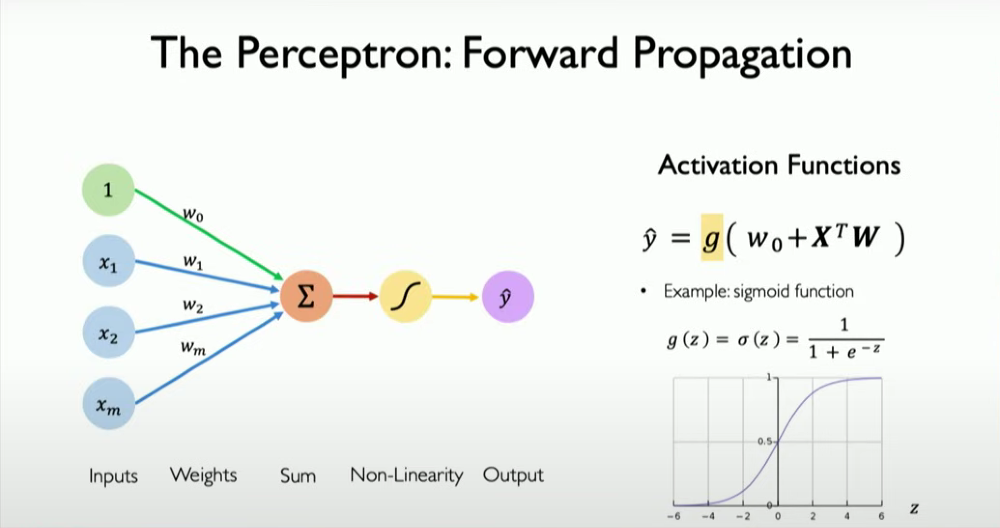

# Learning Plan
I am gonna summarize the course content in my way for the future recalling use.

## [Introduction to Deep Learning](https://www.youtube.com/watch?v=QDX-1M5Nj7s)
**The Perceptron**: the foward propagation

