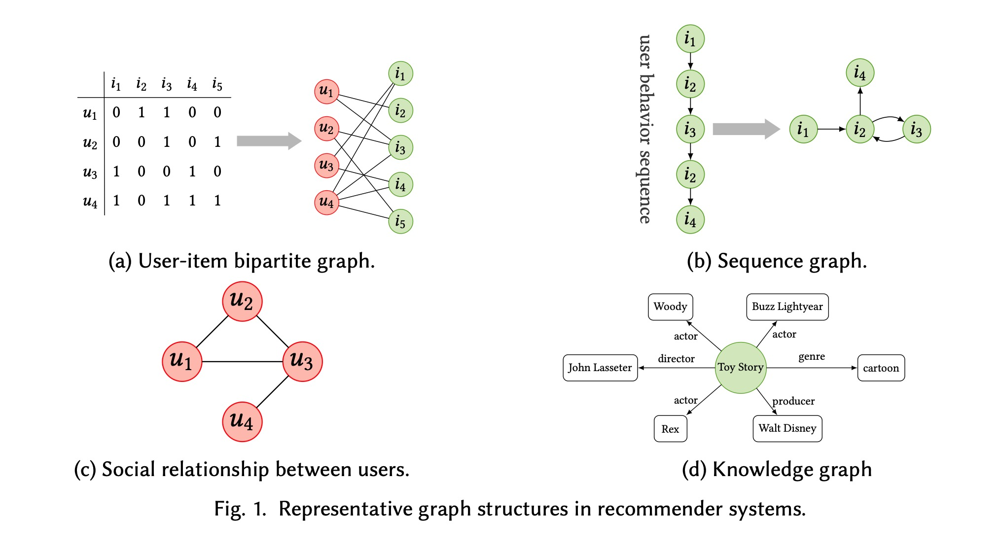

## 4. Blog on Graph Neural Networks (GNN)

- **Literature Review**:
  - Read papers in the model section in Notion.

- **PyG Skills**:
  - Learn PyG programming skills. [Blog](https://mlabonne.github.io/blog/posts/2022_02_20_Graph_Convolution_Network.html), [GitHub](https://github.com/mlabonne/graph-neural-network-course).
  - Implement GNN neural networks. Have implemented an introductory level GCN
  - try to implement GAN
  - PYG 算子分类 [什么是算子](https://zhuanlan.zhihu.com/p/533725319)
    - operator classification: [PYG cheatsheet](https://pytorch-geometric.readthedocs.io/en/latest/cheatsheet/gnn_cheatsheet.html)
  - [torch profiler](https://pytorch.org/docs/stable/profiler.html)

  ## the compiler of geometric deep learning about sparsity?
  ### main focus, probably
  - [SparseTir](https://arxiv.org/abs/2207.04606)
   - [video explanation](https://www.google.com/search?q=sparsetir+video&rlz=1C1ONGR_enUS1055US1055&oq=sparsetir+vi&gs_lcrp=EgZjaHJvbWUqCAgAEEUYJxg7MggIABBFGCcYOzIGCAEQRRg5qAIAsAIA&sourceid=chrome&ie=UTF-8#fpstate=ive&vld=cid:49517380,vid:dGeUOPh37gU,st:0)
  - learn [triton](https://triton-lang.org/main/index.html)

  task details:
  organize the workload of sparsetir: sddmm; spmm; gather+gemm+scatter

  ### the background of the geometric deep learning
  - [graph networks](https://arxiv.org/pdf/2310.11829.pdf)
  - [general intro to geometric deep learning](https://geometricdeeplearning.com/blogs/)

  #### SparseTir Workload
  - understand the structure of the [machine learning compilers](https://huyenchip.com/2021/09/07/a-friendly-introduction-to-machine-learning-compilers-and-optimizers.html)
  - workloads of sparsetir:
    1. sddmm: sampled dense-dense matrix multiplication sddmm for caculating attention score $$ B_{i,j} = \sum_{k=1}^{d} A_{i,j} X_{i,k} Y_{k,j} $$
    2. spmm: sparse-dense matrix multiplication, [visualExplanation]https://www.researchgate.net/figure/Conceptual-view-of-SpMM-and-SDDMM-sparse-matrix-the-values-may-change-but-the-sparsity_fig3_330891126) [mathematic explaination](https://www.google.com/imgres?imgurl=https%3A%2F%2Fars.els-cdn.com%2Fcontent%2Fimage%2F3-s2.0-B9780124201583000095-f09-14-9780124201583.jpg&tbnid=Ud5EYzvA8wLcfM&vet=10CAIQxiAoAGoXChMI-PDtx4qpgwMVAAAAAB0AAAAAEA8..i&imgrefurl=https%3A%2F%2Fwww.sciencedirect.com%2Ftopics%2Fcomputer-science%2Fsparse-matrix-vector-multiplication&docid=PHAZknEooJ31VM&w=433&h=390&itg=1&q=why%20we%20use%20sparse-dense%20matrix%20multiplication&ved=0CAIQxiAoAGoXChMI-PDtx4qpgwMVAAAAAB0AAAAAEA8#imgrc=diPN3FglDALu2M&imgdii=uoQnP7OopCqLOM). spmm works for the message passing
    mathematical formulas: $$Y_{i,k} = \sum_{j=1}^{n} A_{i,j} X_{j,k}$$
    3. gather + gemm + scatter: Relational Gather-Matmul-Scatter(RGMS). This method is to deal with 3 dimensions, The one more dimension comes from the number of relations. In the graph, there are multiple relation among each node. 
     - Relational Graph Convolution Network (RGCN): the essence of RGCN is 3D message passing mechanism.
     $$Y_{i,l} = \sum_{r=1}^{R} \sum_{j=1}^{n} \sum_{k=1}^{d_{in}} A_{r,i,j} X_{j,k} W_{r,k,l}$$
  
  #### SparseTir Workload Redo
  baseline classifications: 
  
  cuSPARSE - NVIDIA's offiical library for sparse tensor algebra

  dgSPARSE - SOTA sparse kernel implemenetation for GNNs; GE-SpMM, DA-SpMM, and PRedS

  a high-performing SpMM kernel on a GPU requires efficient memory access patterns and load balancing.

  PyG and DGL are two open-source frameworks. 

  [all relavant gnns](https://theaisummer.com/gnn-architectures/)

  ##### SPMM
  ###### 1.GSPMM
  spmm: sparse-dense matrix multiplication, the most generic sparse operator in deep learning. 
  GE-SpMM and DA-SpMM in dgSPARSE are state-of-the-art (STOA) kernel implementations.
  $$Y_{i,k} = \sum_{j=1}^{n} A_{i,j} X_{j,k}$$

  
  Here, \( k = n \). In a graph, \( x \) multiplies each column in the feature matrix to obtain three n or k dimensional vectors and finally sums them together based on \( j \) to get the \( i \)-th row in the output feature matrix.

  Applications: Locally Optimal Block Preconditioned Conjugate Gradient.
  Typical Example: PyG's `GCNConv()` for message passing is not exactly this but similar:
  $$h_i = \sum_{j \in N_i} \frac{1}{\sqrt{\text{deg}(i) \text{deg}(j)}} W x_j$$
  Here, \( A \) is an adjacency matrix, representing the connections among nodes. 
  \( Y \) is the summation of message passing.

  In sparsetir, for load balancing, they reorganize the sparse matrix. Based on the connection number of each node, the sparse matrix is separated into several dense matrices (padding increases FLOPs).
  

  When the hyp format increases the number of partitions, the memory transactions will increase, and finally, the benefit of column partitioning saturates. Generally, column partitioning is beneficial.

  ###### 2.Multi-head SPMM
  Based on my understanding, after calculating the attention scores, we could perform a multi-head SPMM:
  $$h_i = \alpha_{i1} Wx_1 + \alpha_{i2} Wx_2 + \alpha_{i3} Wx_3 + \alpha_{i4} Wx_4$$

  ##### SDDMM
  ###### 1.GSDDMM
  sddmm: Sampled Dense-Dense Matrix Multiplication.
  PRedS in dgSPARSE are state-of-the-art (STOA) kernel implementations. (1. load/store intrinsics 2. intra-group and inter-group)
  Applications: gamma poisson, sparse factor analysis, and alternating least squares.
  $$B_{i,j} = \sum_{k=1}^{d} A_{i,j} X_{i,k} Y_{k,j}$$

  ###### 2.Multi-head SDDMM
  [SDDMM in multi-attention](https://docs.dgl.ai/en/1.1.x/notebooks/sparse/graph_transformer.html)

  ##### SPMM and SDDMM Visualization in the Conceptual View; sparsity in transformers
  

  In SpMM, \( S \) is a sparse matrix. We only need to multiply \( O[i][:] = S[i][:] \) (here we only select non-zero elements on \( j \)) with \( D[j][:] \) and aggregate on \( j \).

  In SDDMM, we do \( D1[j][:] \) * \( D2[i][:] \) dot product to get one scalar and use this scalar to multiply \( S[i][j] = O[i][j] \).

  [Summary of SPMM and SDDMM](https://www.researchgate.net/publication/330891126_Adaptive_sparse_tiling_for_sparse_matrix_multiplication)

  Sparsity in Transformers comes from 1.sparse attention(multi-head spmm and sddmm) and 2.sparsity in the network weights after pruning. 

  ###### 1.multi-head spmm and sddmm in sparsetir(sparse attention)
  In sparsetir, longformer and pixelated butterfly transformer - sparse matrix: band matrix and butterfly matrix. (details, later explores)

  ###### 2.sparse weight(networking pruning)
  structured pruning:
    - [block pruning](https://aclanthology.org/2021.emnlp-main.829.pdf): the operator used in block-pruned transformer is SpMM
  
  unstructured pruning:

  ##### Relational Gather-Matmul-Scatter
  $$Y_{i,l} = \sum_{r=1}^{R} \sum_{j=1}^{n} \sum_{k=1}^{d_{in}} A_{r,i,j} X_{j,k} W_{r,k,l}$$

  A and W are 3D sparse matrix. R represents the number of relations. Under each relation, $A_{i,j}$ is a sparse matrix and $W_{k,l}$ is a dense matrix. X is a 2D feature matrix. 

  ###### 1.Relational Graph Convolution Network(RGCN)
  This is a generlalization of GCN mdoel to heterogeneous graphs with multiple relations/edge tyypes.

  Existing GNN libraries only use two stages:
  - $$ T_{r,j,l} = \sum_{k=1}^{d_{in}} X_{j,k} W_{r,k,l} $$ 
  The first stage fuses gathering and matrix multiplication
  - $$ Y_{i,l} = \sum_{r=1}^{R} \sum_{j=1}^{n} A_{r,i,j} T_{r,j,l} $$ 
  The second stage performs scattering. 

  In sparsetir, fuses two  stages into a single operator. 
  

  Firstly, in the gathering and matmul, we do a similar hypo form to partition 2D sparse matrix and get ell forms to multiply with the corresponding weight matrix W. Repeat these steps r times( the number of relations). Finally, we aggregate together.

  generally perform better except increase some flops in the padding.

  ###### 2.Sparse Convolution (a special case of RGMS in 3D cloud point data)
  Assumption is that ELL(1)
  
  brief understanding: 
  Firstly, we have a sparse matrix. when move the sparse matrix with offset like coordinates. Then, we have a multiple relations here. 

  SparseTIR's RGMS cannot beat TorchSparse because the flops of matmul in sparseTIR is quadratic.(two matrix mulplication is cubic so there are R weight matrix. Totally, the matmul is quadratic)

  In the related work, there is a summary of current GNN systems and compilers.

  #### Triton code

  ### General Roadmap of the Survey of Sparse GNN
  - Step 1: model sparse input. 
    1. list all gnn function using sparse input and the corresponding mathematical formula from PYG or DGL
    2. bonus what's the sparse input matrix ?

  - Step 2: the current implementations of sparse operator like spmm, sddmm, gather-matl-scatter, scatter ...
    1. need to learn basic parallel computing like general matrix multiplication. 
    2. how the current implementation of spmm, sddmm ... in the engineering part. Using mathematical formula or visualization.

  - Step 3: sparse operator local design ...

  My current responsibility is to organize info in the step1 and step2. browse all relevant info and organize them in the structure. 

  #### Step 1: model input
  models:  GCN, GraphSAGE, GIN, GAT, PNA, EdgeCNN
  
  PYG functions: GCNConv; SAGEConv; GINConv; GATConv / GATv2Conv; PNAConv; EdgeConv 

  Operators: spmm, sddmm, gather-matl-scatter, scatter

  | Models   | PYG Func   | Operators   |
  |------------|------------|------------|
  | GCN | GCNConv | SPMM |
  | GraphSAGE | SAGEConv | SPMM & scatter |
  | GIN | GINConv | gather-mul-scatter |
  | GAT | GATConv / GATv2Conv| SPMM & SDDMM |
  | PNA | PNAConv| SPMM & scatter |
  | EdgeCNN | EdgeConv | gather-mul-scatter | 

  Mathematical model formula corresponding to operators:

  **GCN**: 
  - Message Passing Stage: $$h_i = \sum_{j \in N_i} \frac{1}{\sqrt{\text{deg}(i) \text{deg}(j)}} W x_j$$ = SPMM
  
  **GraphSAGE**: 
  - [Neighbor Sampling](https://docs.dgl.ai/en/0.9.x/tutorials/large/L0_neighbor_sampling_overview.html) 
  - Aggregation: [scatter_add, scatter_mean, scatter_max](https://pytorch-scatter.readthedocs.io/en/latest/functions/scatter.html) like ($$\text{mean}_{j \in \mathcal{N}_i} (h_j)$$) = SCATTER
  - linear transformation $$h_i' = W_1 h_i + W_2 \cdot \text{mean}_{j \in \mathcal{N}_i} (h_j)$$ = SPMM
  
  **GIN** :
  -   = gather-mul-scatter
  
  **GAT** :
  -  calculate node embedding  $$h_i = \alpha_{i1} Wx_1 + \alpha_{i2} Wx_2 + \alpha_{i3} Wx_3 + \alpha_{i4} Wx_4$$ = SPMM
  - [calculate attention scores](https://docs.dgl.ai/en/0.8.x/tutorials/models/1_gnn/9_gat.html) $$e_{ij}^{(l)} = \text{LeakyReLU}\left(\mathbf{a}^{(l)T} \left[ \mathbf{z}_i^{(l)} \| \mathbf{z}_j^{(l)} \right]\right)$$
$$\alpha_{ij}^{(l)} = \frac{\exp\left(e_{ij}^{(l)}\right)}{\sum_{k \in \mathcal{N}(i)} \exp\left(e_{ik}^{(l)}\right)}$$
$$h_i^{(l+1)} = \sigma\left( \sum_{j \in \mathcal{N}(i)} \alpha_{ij}^{(l)} \mathbf{z}_j^{(l)} \right)$$
 = SDDMM (?)

 **PNA**:
  - [mlp](https://pytorch-geometric.readthedocs.io/en/latest/generated/torch_geometric.nn.conv.PNAConv.html#torch_geometric.nn.conv.PNAConv) $$x'_i = \gamma \circ \left( x_i \oplus \bigoplus_{j \in N(i)} h_\theta (x_i, x_j) \right)$$ = SPMM
  - aggregation = scatter

 **EdgeConv**(point cloud)
  - gather-mul-scatter

  #### Step 2: operator analysis

  [Matrix Multiplication in Parallel Computing](https://coffeebeforearch.github.io/2020/06/23/mmul.html)
  His corresponding Youtube Channel is fantastic explanation of cuda parallel computing. 

  SPMM

  SDDMM

  Scatter(aggregation)

  gather-mul-scatter

  #### CUDA CODE

  [Guide to Run Cuda in Colab](https://www.wikihow.com/Run-CUDA-C-or-C%2B%2B-on-Jupyter-(Google-Colab)#:~:text=To%20run%20CUDA%20C%2FC%2B%2B,the%20beginning%20of%20your%20code.&text=If%20all%20went%20well%20this,%3A%20result%20is%208%5Cn%20.)

  [cuda code](https://github.com/Yuxuan-Zhang-Dexter/cuda-practice.git)

  Video Tutorials:
  1. [parallel computing and scientific machine learning](https://www.youtube.com/watch?v=3IoqyXmAAkU&list=PLCAl7tjCwWyGjdzOOnlbGnVNZk0kB8VSa) and [its blog](https://book.sciml.ai/)
  2. [cuda crash course](https://www.youtube.com/watch?v=3xfyiWhtvZw&t=378s)

  ### reinforce code understanding abbout spmm, sddmm, scatter, gather-mul-scatter
  1. DIMSET in PYG: think from computer perspective
  2. redo the past organization
  3. consider sparse input: GCN and MeshGPT

  ### 01-14-meeting
  1. explore graphs concepts, what type of dataset we could transform into graph like citation, molecular graph...
  2. spmm in the gnns, next sddmm
  3. parallel computing

  ### model inputs
  [hugging face rough classification](https://huggingface.co/graphs-datasets)
  [PYG General classification](https://pytorch-geometric.readthedocs.io/en/latest/modules/datasets.html#heterogeneous-datasets)

  [stanford graph dataset collections](https://snap.stanford.edu/data/)
  based on PYG classifications,

  [all available graph datasets](https://paperswithcode.com/datasets?mod=graphs)

  #### Code with Datasets:
  **KarateClub**: Zachary's karate club network; sparse feature matrix - gcn

  **[TUDataset](https://chrsmrrs.github.io/datasets/docs/datasets/)**: graph kernel benchmark dataset
  - small molecules like AIDS - sparse connections
  - bioinformatics like PROTEINS - sparse connections
  - computer vision ?
  - social netwrok - sparse connections

  **Planetoid**:
  They represent networks of research papers, where each connection is a citation.

  - Cora: it consists of 2,708 machine learning papers that belong to one of seven categories. Node features represent the presence (1) or absence (0) of 1,433 words in a paper (binary bag of words).
  - CiteSeer: it is a bigger but similar dataset of 3,327 scientific papers to classify into one of six categories. Node features represent the presence (1) or absence (0) of 3,703 words in a paper.
  - PubMed: it is an even bigger dataset with 19,717 scientific publications about diabetes from PubMed’s database, classified into three categories. Node features are TF-IDF weighted word vector from a dictionary of 500 unique words.

  #### categories of graph datasets
  [Open Graph Benchmark Paper](https://arxiv.org/pdf/2005.00687.pdf)

  [survey example](https://arxiv.org/pdf/2011.02260.pdf)

  ##### classify graph datasets based on data type:
  - Molecular graphs:
  
    1. TUDataset(small molecular, bioinformatics): [the explanation of the molecular graph dataset](https://towardsdatascience.com/building-a-graph-convolutional-network-for-molecular-property-prediction-978b0ae10ec4) shows that atoms are nodes; bonds are edges; connections form a sparse adjacent matrix
    2. [MoleculeNet dataseet benchmark](https://paperswithcode.com/dataset/moleculenet)

  - Social networks:
    1. [stanford large network dataset](https://snap.stanford.edu/data/)
  - Information networks:
    1. Cora, CiteSeer, Pubmed

  - Biological networks
    1. protein in TUDataset
  - source code ASTs
  - Knowledge graphs
    1. [FB15K](https://medium.com/stanford-cs224w/knowledge-graph-embeddings-simplistic-and-powerful-representations-ed43a1a73c7c) and WN18

  #### classify graph datasets based on prediction like DGL
  - Node Property Prediction
    1. Cora,  CiteSeer, PubMed (citation as connections showed by a sparse adjacent matrix) - information network
  - Link Property Prediction (recommendation system)
    1. FB15K and WN18 - very sparse. assuming multiple adjacent matrix under different relations - knowledge graph
    2. stanford large network dataset(snap)
  - Graph Property Prediction
    1. tudataset - molecular graph
    2. Abstract Systax Tree (AST)
  
  OGB graph dataset classification:

  

原创性的工作：
1. movivation：数据来源如何抽象成数据结构
2. self-contribution: organization logics (structure); draw graphs for understanding - Lucid.app；questions
3. questions and problems
4. appendix

1.  生活中哪些应用是可以被抽象成图的 数据是怎么被抽象的，具体列表，画图
2.  这些东西怎么算的

#### another type of graph data structure
[mesh gpt](https://nihalsid.github.io/mesh-gpt/)
[tabular graph](https://arxiv.org/abs/2307.08623)

##### mesh gpt
[triangle mesh explanation](https://medium.com/@daviddelaiglesiacastro/3d-point-cloud-generation-from-3d-triangular-mesh-bbb602ecf238)

### 02/04/2024
emphasis: relation -> sparsity；architecutre + algorithm

at the level of hardware abstraction, particularly concerning computing and memory layers, devising methods to efficiently compute and store relational data poses a significant challenge that we aim to tackle in the future.

2. point cloud graph stucture 
1. open catalyst project (mlperf benchmark) + moleculenet deep chem 数据源到数据之间怎么转换
4. network - citation, social network in recommendation syste - network X ; recommendation system
3. knowledge graph 再看看

Concise summary of my work purpose: I need to abstract common relations from dataset and model in algorithms. When I want to accelerate the model at hardware abstraction, I need to thinks of how to deal with sparsity in hardware, which is caused by relations in the model. 

specific tasks:
1. 重新整理motivations： 明确工作目标
2. 重新整理report 结构： initial step- 理解什么数据转化成graph； second step - 思考之间的relations
3. 整理成repo

[graph topology](https://arxiv.org/pdf/2206.00606.pdf)

[cloud point to graph](https://m-lin-dm.github.io/graph-creation/)

练习画图

1. motivation 想要体现什么, 图的逻辑完整，高度压缩和总结
2. dense informative 
3. 字体大小和格式都要统一，一致性
edrawmax
ominigraffle
查查画图的软件

文章：
relbench - dataset = relational database - dlrm
one2345plus - point cloud
mesh face graph -> egnn 位置信息加进去

整个逻辑: relation -> model -> 底层sparse

研究方向: relation -> sparse

relations: (去定义和分类这一系列的关系)
relation database
graph
mesh + voxel: 位置关系(point cloude)和face 约束（定义形状）和连接关系？
face graph - 失去了位置关系(point cloude)和face 约束（定义形状），只有连接关系
molecule
network
point cloud 位置关系

阅读方法：
1.找resources
2.filter 只看重点并且 high-level, 形成结构

大图：
data source： relation data -> graph (如何转换，不一定是graph)
graph 即是data source 也是 model

理解数据: data mining - 未来主流: 除了llm，多模态信息输入(text, video, relational data)

research:
调研->motivation(develop thinking for futures), 根据tech trends去预测一个方向的未来
做有意义的研究

create paper list to include paper titles - citation - main points

survey learning sample: 
https://arxiv.org/pdf/2312.15234.pdf

survey title: towards efficient machine laerning for relational data: from algorithms to systems

  

